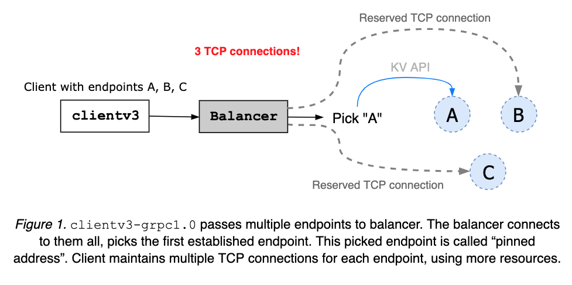
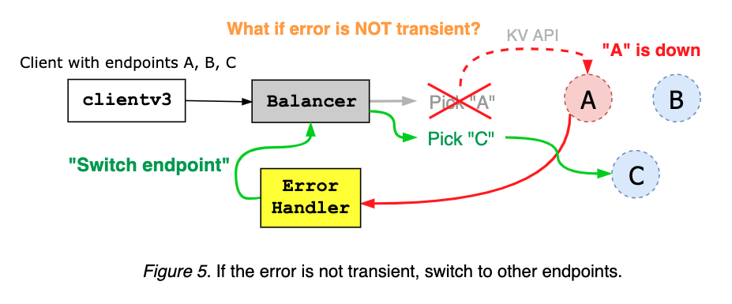
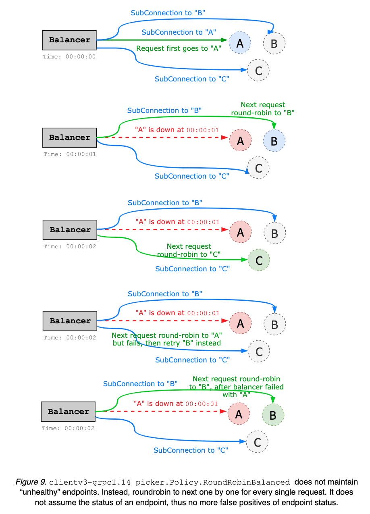

etcd Client Design
==================

*Gyuho Lee (github.com/gyuho, Amazon Web Services, Inc.), Joe Betz (github.com/jpbetz, Google Inc.)*

Introduction
============

etcd server has proven its robustness with years of failure injection testing. Most complex application logic is already handled by etcd server and its data stores (e.g. cluster membership is transparent to clients, with Raft-layer forwarding proposals to leader). Although server components are correct, its composition with client requires a different set of intricate protocols to guarantee its correctness and high availability under faulty conditions. Ideally, etcd server provides one logical cluster view of many physical machines, and client implements automatic failover between replicas. This documents client architectural decisions and its implementation details.

Glossary
========

*clientv3*: etcd Official Go client for etcd v3 API.

*clientv3-grpc1.0*: Official client implementation, with [`grpc-go v1.0.x`](https://github.com/grpc/grpc-go/releases/tag/v1.0.0), which is used in latest etcd v3.1.

*clientv3-grpc1.7*: Official client implementation, with [`grpc-go v1.7.x`](https://github.com/grpc/grpc-go/releases/tag/v1.7.0), which is used in latest etcd v3.2 and v3.3.

*clientv3-grpc1.23*: Official client implementation, with [`grpc-go v1.23.x`](https://github.com/grpc/grpc-go/releases/tag/v1.23.0), which is used in latest etcd v3.4.

*Balancer*: etcd client load balancer that implements retry and failover mechanism. etcd client should automatically balance loads between multiple endpoints.

*Endpoints*: A list of etcd server endpoints that clients can connect to. Typically, 3 or 5 client URLs of an etcd cluster.

*Pinned endpoint*: When configured with multiple endpoints, <= v3.3 client balancer chooses only one endpoint to establish a TCP connection, in order to conserve total open connections to etcd cluster. In v3.4, balancer round-robins pinned endpoints for every request, thus distributing loads more evenly.

*Client Connection*: TCP connection that has been established to an etcd server, via gRPC Dial.

*Sub Connection*: gRPC SubConn interface. Each sub-connection contains a list of addresses. Balancer creates a SubConn from a list of resolved addresses. gRPC ClientConn can map to multiple SubConn (e.g. example.com resolves to `10.10.10.1` and `10.10.10.2` of two sub-connections). etcd v3.4 balancer employs internal resolver to establish one sub-connection for each endpoint.

*Transient disconnect*: When gRPC server returns a status error of [`code Unavailable`](https://godoc.org/google.golang.org/grpc/codes#Code).

Client Requirements
===================

*Correctness*. Requests may fail in the presence of server faults. However, it never violates consistency guarantees: global ordering properties, never write corrupted data, at-most once semantics for mutable operations, watch never observes partial events, and so on.

*Liveness*. Servers may fail or disconnect briefly. Clients should make progress in either way. Clients should [never deadlock](https://github.com/etcd-io/etcd-with-comments/issues/8980) waiting for a server to come back from offline, unless configured to do so. Ideally, clients detect unavailable servers with HTTP/2 ping and failover to other nodes with clear error messages.

*Effectiveness*. Clients should operate effectively with minimum resources: previous TCP connections should be [gracefully closed](https://github.com/etcd-io/etcd-with-comments/issues/9212) after endpoint switch. Failover mechanism should effectively predict the next replica to connect, without wastefully retrying on failed nodes.

*Portability*. Official client should be clearly documented and its implementation be applicable to other language bindings. Error handling between different language bindings should be consistent. Since etcd is fully committed to gRPC, implementation should be closely aligned with gRPC long-term design goals (e.g. pluggable retry policy should be compatible with [gRPC retry](https://github.com/grpc/proposal/blob/master/A6-client-retries.md)). Upgrades between two client versions should be non-disruptive.

Client Overview
===============

etcd client implements the following components:

* balancer that establishes gRPC connections to an etcd cluster,
* API client that sends RPCs to an etcd server, and
* error handler that decides whether to retry a failed request or switch endpoints.

Languages may differ in how to establish an initial connection (e.g. configure TLS), how to encode and send Protocol Buffer messages to server, how to handle stream RPCs, and so on. However, errors returned from etcd server will be the same. So should be error handling and retry policy.

For example, etcd server may return `"rpc error: code = Unavailable desc = etcdserver: request timed out"`, which is transient error that expects retries. Or return `rpc error: code = InvalidArgument desc = etcdserver: key is not provided`, which means request was invalid and should not be retried. Go client can parse errors with `google.golang.org/grpc/status.FromError`, and Java client with `io.grpc.Status.fromThrowable`.

clientv3-grpc1.0: Balancer Overview
-----------------------------------

`clientv3-grpc1.0` maintains multiple TCP connections when configured with multiple etcd endpoints. Then pick one address and use it to send all client requests. The pinned address is maintained until the client object is closed (see *Figure 1*). When the client receives an error, it randomly picks another and retries.

clientv3-grpc1.0: Balancer Limitation
-------------------------------------

`clientv3-grpc1.0` opening multiple TCP connections may provide faster balancer failover but requires more resources. The balancer does not understand node’s health status or cluster membership. So, it is possible that balancer gets stuck with one failed or partitioned node.

clientv3-grpc1.7: Balancer Overview
------------------------------------

`clientv3-grpc1.7` maintains only one TCP connection to a chosen etcd server. When given multiple cluster endpoints, a client first tries to connect to them all. As soon as one connection is up, balancer pins the address, closing others (see *Figure 2*). The pinned address is to be maintained until the client object is closed. An error, from server or client network fault, is sent to client error handler (see *Figure 3*).

The client error handler takes an error from gRPC server, and decides whether to retry on the same endpoint, or to switch to other addresses, based on the error code and message (see *Figure 4* and *Figure 5*).

Stream RPCs, such as Watch and KeepAlive, are often requested with no timeouts. Instead, client can send periodic HTTP/2 pings to check the status of a pinned endpoint; if the server does not respond to the ping, balancer switches to other endpoints (see *Figure 6*).

clientv3-grpc1.7: Balancer Limitation
-------------------------------------

`clientv3-grpc1.7` balancer sends HTTP/2 keepalives to detect disconnects from streaming requests. It is a simple gRPC server ping mechanism and does not reason about cluster membership, thus unable to detect network partitions. Since partitioned gRPC server can still respond to client pings, balancer may get stuck with a partitioned node. Ideally, keepalive ping detects partition and triggers endpoint switch, before request time-out (see [etcd#8673](https://github.com/etcd-io/etcd-with-comments/issues/8673) and *Figure 7*).

`clientv3-grpc1.7` balancer maintains a list of unhealthy endpoints. Disconnected addresses are added to “unhealthy” list, and considered unavailable until after wait duration, which is hard coded as dial timeout with default value 5-second. Balancer can have false positives on which endpoints are unhealthy. For instance, endpoint A may come back right after being blacklisted, but still unusable for next 5 seconds (see *Figure 8*).

`clientv3-grpc1.0` suffered the same problems above.

Upstream gRPC Go had already migrated to new balancer interface. For example, `clientv3-grpc1.7` underlying balancer implementation uses new gRPC balancer and tries to be consistent with old balancer behaviors. While its compatibility has been maintained reasonably well, etcd client still [suffered from subtle breaking changes](https://github.com/grpc/grpc-go/issues/1649). Furthermore, gRPC maintainer recommends to [not rely on the old balancer interface](https://github.com/grpc/grpc-go/issues/1942#issuecomment-375368665). In general, to get better support from upstream, it is best to be in sync with latest gRPC releases. And new features, such as retry policy, may not be backported to gRPC 1.7 branch. Thus, both etcd server and client must migrate to latest gRPC versions.

clientv3-grpc1.23: Balancer Overview
------------------------------------

`clientv3-grpc1.7` is so tightly coupled with old gRPC interface, that every single gRPC dependency upgrade broke client behavior. Majority of development and debugging efforts were devoted to fixing those client behavior changes. As a result, its implementation has become overly complicated with bad assumptions on server connectivities.

The primary goal of `clientv3-grpc1.23` is to simplify balancer failover logic; rather than maintaining a list of unhealthy endpoints, which may be stale, simply roundrobin to the next endpoint whenever client gets disconnected from the current endpoint. It does not assume endpoint status. Thus, no more complicated status tracking is needed (see *Figure 8* and above). Upgrading to `clientv3-grpc1.23` should be no issue; all changes were internal while keeping all the backward compatibilities.

Internally, when given multiple endpoints, `clientv3-grpc1.23` creates multiple sub-connections (one sub-connection per each endpoint), while `clientv3-grpc1.7` creates only one connection to a pinned endpoint (see *Figure 9*). For instance, in 5-node cluster, `clientv3-grpc1.23` balancer would require 5 TCP connections, while `clientv3-grpc1.7` only requires one. By preserving the pool of TCP connections, `clientv3-grpc1.23` may consume more resources but provide more flexible load balancer with better failover performance. The default balancing policy is round robin but can be easily extended to support other types of balancers (e.g. power of two, pick leader, etc.). `clientv3-grpc1.23` uses gRPC resolver group and implements balancer picker policy, in order to delegate complex balancing work to upstream gRPC. On the other hand, `clientv3-grpc1.7` manually handles each gRPC connection and balancer failover, which complicates the implementation. `clientv3-grpc1.23` implements retry in the gRPC interceptor chain that automatically handles gRPC internal errors and enables more advanced retry policies like backoff, while `clientv3-grpc1.7` manually interprets gRPC errors for retries.

clientv3-grpc1.23: Balancer Limitation
--------------------------------------

Improvements can be made by caching the status of each endpoint. For instance, balancer can ping each server in advance to maintain a list of healthy candidates, and use this information when doing round-robin. Or when disconnected, balancer can prioritize healthy endpoints. This may complicate the balancer implementation, thus can be addressed in later versions.

Client-side keepalive ping still does not reason about network partitions. Streaming request may get stuck with a partitioned node. Advanced health checking service need to be implemented to understand the cluster membership (see [etcd#8673](https://github.com/etcd-io/etcd-with-comments/issues/8673) for more detail).

Currently, retry logic is handled manually as an interceptor. This may be simplified via [official gRPC retries](https://github.com/grpc/proposal/blob/master/A6-client-retries.md).
